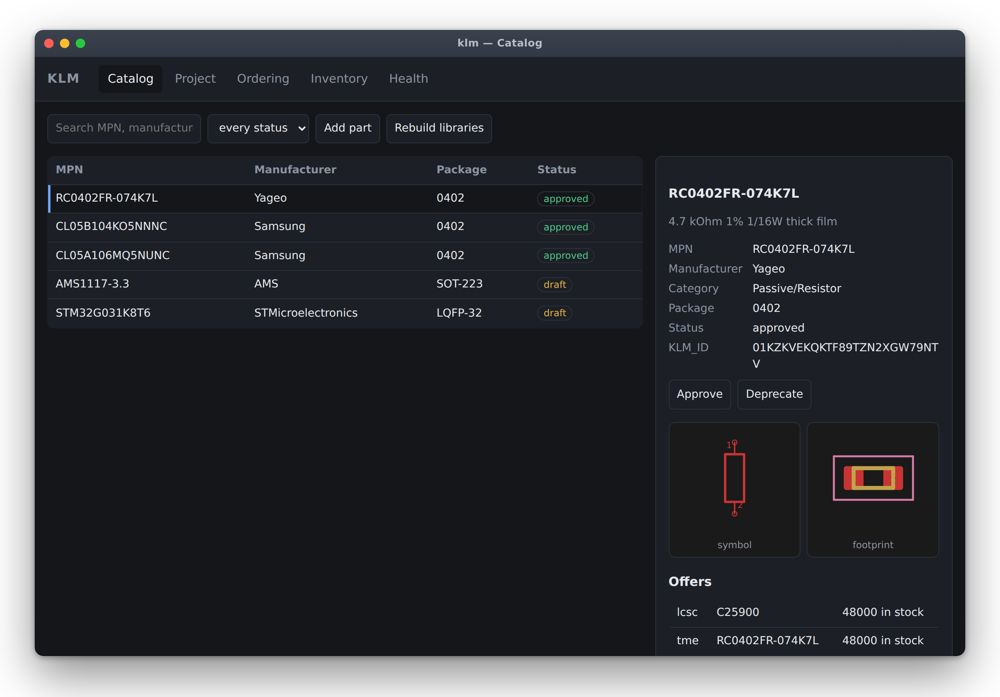
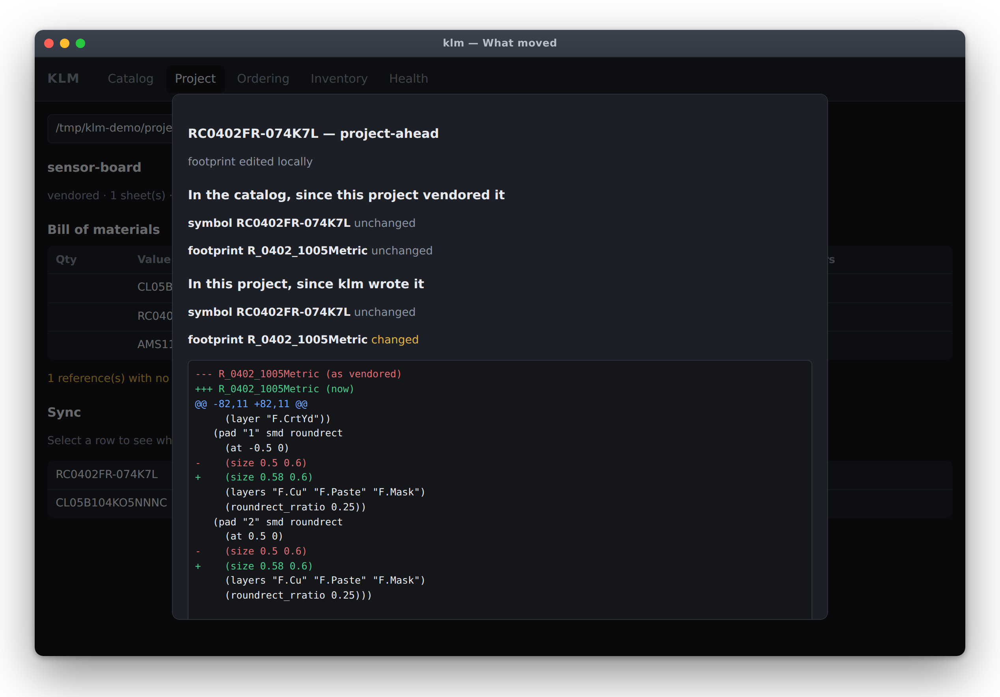
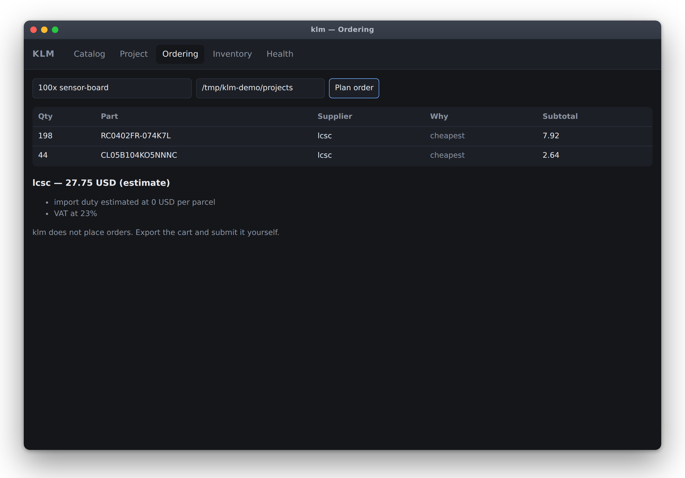
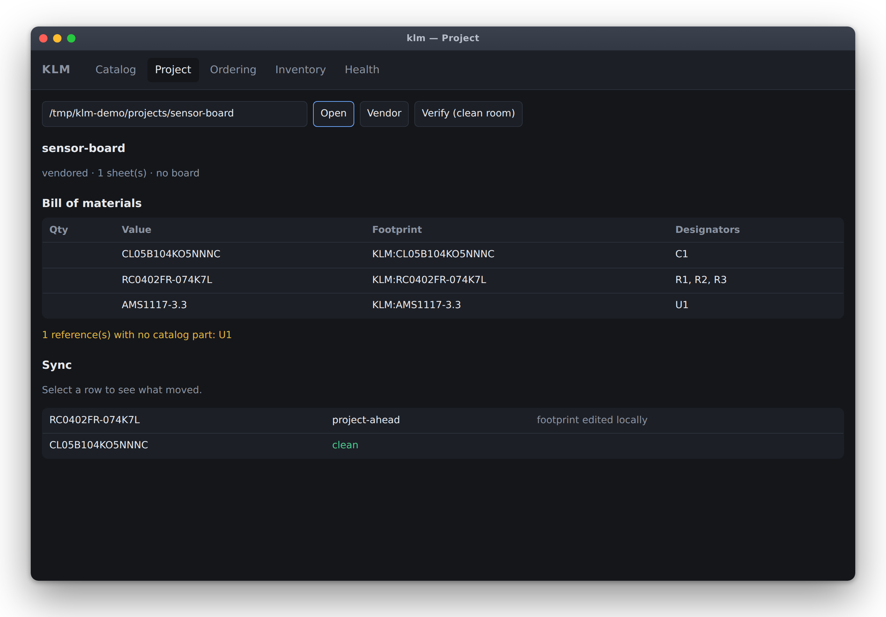
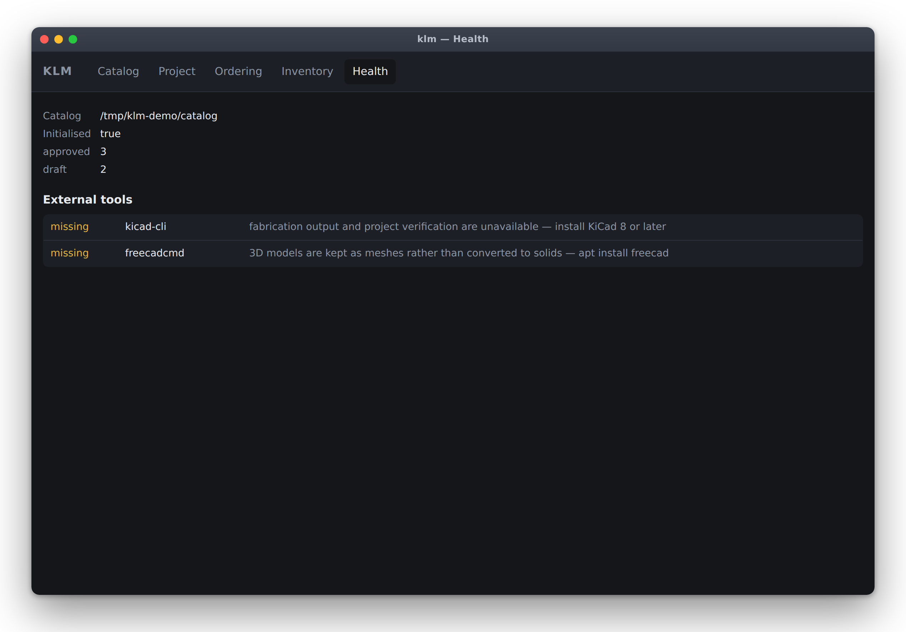

<p align="center">
  
</p>

<h1 align="center">klm — KiCad Library Manager</h1>

<p align="center">
  Find a part, draw it, buy it, fab it — a day of manual work turned into a
  reviewed, mostly-automatic pipeline.<br>
  <sub>Desktop app and CLI · Windows, macOS, Linux · sources from TME and LCSC</sub>
</p>

<p align="center">
  
</p>

**Status: phases 0–8 built** — the catalog, field schema and linter, TME/LCSC sourcing, the asset
pipeline, library sync, fabrication output, repository scaffolding and CI, ordering and inventory,
and the desktop app. The AI research agent (phase 9) is next. See
[`docs/13-roadmap.md`](docs/13-roadmap.md) for what that means in detail, and read
[`docs/01-vision-and-problems.md`](docs/01-vision-and-problems.md) first for why any of it exists.

## Install

Every release carries a build for all three platforms —
[Releases](https://github.com/RolandSobczak/klm/releases):

| Platform | Download | Then |
|---|---|---|
| Windows | `klm-setup-<v>.exe` | Run it. Next, next, next — no administrator needed |
| macOS | `klm-<v>-macos.zip` | Unzip, drag `klm.app` to Applications |
| Linux | `klm-<v>-linux-x86_64.tar.gz` | Unpack, run `klm/klm-app` |
| Any | — | `pip install 'klm[app]'`, or `pipx install klm` for the CLI alone |

Nothing is code-signed yet, so the first launch needs one extra click: on Windows, SmartScreen's
*More info* → *Run anyway*; on macOS, right-click → *Open* instead of double-clicking. Both need
paid certificates to fix, and `packaging/README.md` says what that would take.

Then:

```bash
klm init
klm app     # native window; `klm serve` gives a URL instead
```

On Linux the window needs WebKitGTK (`apt install gir1.2-webkit2-4.1`). Without it `klm app` says
so and falls back to serving a URL, which is also what to use over SSH or in a container.

Everything the window does, the CLI does — that is a rule, not a coincidence: *if the GUI can do
something the CLI cannot, that is a bug in the CLI.*

## The problem, in one paragraph

Sourcing parts in Poland means TME and LCSC — DigiKey and Mouser shipping (~80 PLN) makes them
unusable for a hobby order. So every part has to be checked for local availability by hand.
Once a part is chosen, its symbol, footprint and 3D model have to be made or scavenged, and no
matter how careful you are the field names drift (`MPN` here, `Manufacturer_Part_Number` there),
so BOMs never line up. Ordering means hand-built spreadsheets. Fabrication means hand-fixing
JLCPCB's rotation quirks. And because every feature gets prototyped on its own little board
before being folded into the big project, parts live in *global* libraries — which makes any
repository you push to GitHub incomplete for a collaborator, so you end up maintaining the same
part twice.

## What klm does about it

| Pain | What klm does |
|---|---|
| Local availability | One catalog of parts, each with live TME/LCSC offers, stock and price breaks |
| Asset drudgery | Automated symbol + footprint + STEP acquisition, with a QA gate before anything lands |
| Field-name drift | One canonical field schema, enforced by a linter with `--fix` |
| Order spreadsheets | Multi-project BOM consolidation → per-supplier carts, MOQ and shipping aware |
| JLCPCB output | Gerbers, drill, BOM and CPL with rotation/offset corrections applied and *learned* |
| Global ↔ project libs | `klm vendor` copies used parts into the project and rewrites references; `klm promote` goes the other way; a lock file tracks drift |
| "Will it open for someone else?" | `klm scaffold` generates CI that verifies self-containment on a clean checkout and publishes PDFs, BOMs and fab zips on merge |
| Finding parts at all | An AI research agent that searches, reads datasheets, and proposes a part for you to approve |

## The app

<table>
<tr>
<td width="50%" valign="top">

<p><b>What moved, and on which side.</b> The catalog's copy and the project's copy
are compared against their own recorded state — never against each other, which
would never stop differing. This one says the footprint was widened locally and
the catalog has not moved.</p>
</td>
<td width="50%" valign="top">

<p><b>Ordering that shows its working.</b> Demand across projects, minus what is
on the shelf, plus spares, split between suppliers — with the reason on every
line and the assumptions behind every estimate. klm does not place the order.</p>
</td>
</tr>
<tr>
<td width="50%" valign="top">

<p><b>A project at a glance.</b> BOM read straight from the schematic — no KiCad
needed — plus vendoring, sync state and clean-room verification.</p>
</td>
<td width="50%" valign="top">

<p><b>Honest about what is missing.</b> Every absent tool is named with the
consequence and the fix. klm degrades; it does not fail with a stack trace.</p>
</td>
</tr>
</table>

<sub>Real screenshots of the running application, over a seeded demo catalog —
five parts, two suppliers, one small board. Regenerate with
<code>python tools/screenshots.py</code>.</sub>

## Documentation map

| Document | What's in it |
|---|---|
| [01 — Vision and problems](docs/01-vision-and-problems.md) | Problem statement, goals, non-goals, success criteria |
| [02 — Domain model](docs/02-domain-model.md) | Part, Offer, Asset, Project, BOM, Order, Stock — and part identity |
| [03 — Architecture](docs/03-architecture.md) | Layers, processes, the lossless S-expression rule, data flow |
| [04 — Catalog and storage](docs/04-catalog-and-storage.md) | SQLite schema, git-versioned export, generated `.kicad_sym` |
| [05 — Field schema and linting](docs/05-field-schema-and-linting.md) | Canonical fields, aliases, value normalization, lint rules |
| [06 — Library sync](docs/06-library-sync.md) | The flagship problem: vendoring, promotion, drift, conflicts |
| [07 — Supplier integration](docs/07-supplier-integration.md) | TME and LCSC adapters, caching, the offer model, legal caveats |
| [08 — Asset pipeline](docs/08-asset-pipeline.md) | Symbol/footprint/3D acquisition, FreeCAD conversion, QA checks |
| [09 — Manufacturing outputs](docs/09-manufacturing-outputs.md) | Gerbers, drill, BOM, CPL, rotation corrections, fab feedback |
| [10 — Ordering and inventory](docs/10-ordering-and-inventory.md) | Demand aggregation, supplier split, stock, drawer labels |
| [11 — AI research agent](docs/11-ai-research-agent.md) | Requirement spec, tools, guardrails, provenance, approval |
| [12 — CLI and desktop app](docs/12-cli-and-desktop-app.md) | Command surface, screens, the local API |
| [13 — Roadmap](docs/13-roadmap.md) | Phased delivery, what to build first and why |
| [14 — Open questions](docs/14-open-questions.md) | Everything that needs verifying before it's built on |
| [15 — Scaffolding and CI/CD](docs/15-project-scaffolding-and-ci.md) | Repo starter, clean-room verification, artifact workflows |
| [ADRs](docs/adr/) | Decision records with the alternatives that were rejected |

## Naming

The tool is `klm`. The Python package is `klm`. The global library set it generates is
`KLM` (symbols `KLM:<name>`, footprints `KLM:<name>`).
